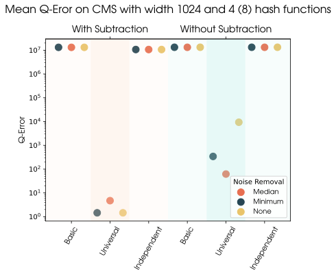

# CMS for join cardinality estimation on knowlege graphs

## Description

Experiments to explore the use of count min sketches for the cardinallity estimation of joins on knoweledge graphs.

## Getting Started

### Dependencies

* All the packages contained in the `requirements.txt`

### Installing

* Clone the project
* Install the requirements using `pip install -r requirements.txt`
* Get your dataset in HDF format

### Executing program

The most important file for starting experiments is the `final_experiments.py` file in the experiements folder in the src directory.
To configure a run you need to fill in two config files in JSON format. An example is given
by the file `inal_experiment_config.json` and `final_experiment_testdata_subject.json`.

This configuration is for experiments on the WatDiv dataset. In the first file general
options are set like the paths, the used hash functions and many more. Just check it out!

The second file contains the joins. For every join only the predicates are given splitted into
prefix and ending. Besides that you need to set the type of join.

If everything is configured you can start the experiment:
```
python src/experiments/final_experiments.py
```

### Example

The following is a plot showing the mean Q-Error over all the queries in the experiments directory.
As you can see the best technique for reducing the collision seems to be using addition and subtraction and minimum noise.



## Help

The python HDT library seems to only work on Linux (Mac OS has not been tested but should work).
If you want to run this experiments from Windows you should be able to use this with
WSL 2.

## Authors

Contributors names and contact info

Alexander Schröder - alexander.schroeder-t59@rub.de - [LinkedIn](https://de.linkedin.com/in/alexander-schr%C3%B6der-26a1b018a)<br>
Lukas Trost - lukas.trost@rub.de - [LinkedIn](https://example.com)


## License
This project is licensed under the MIT License - see the LICENSE.md file for details.
